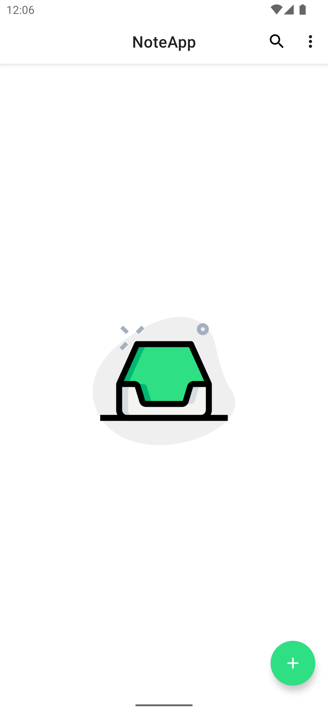
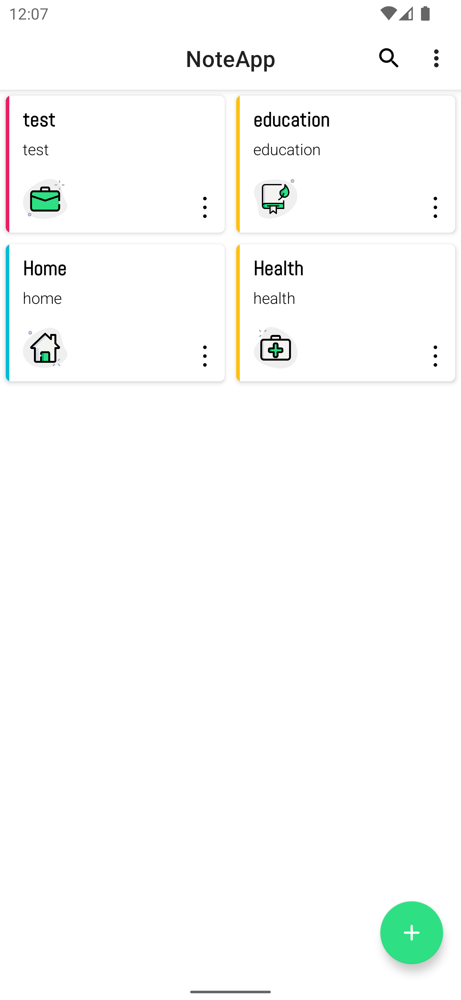
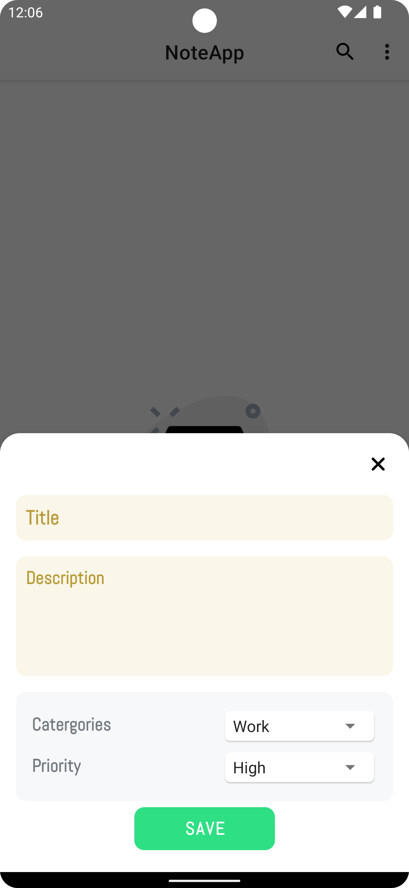
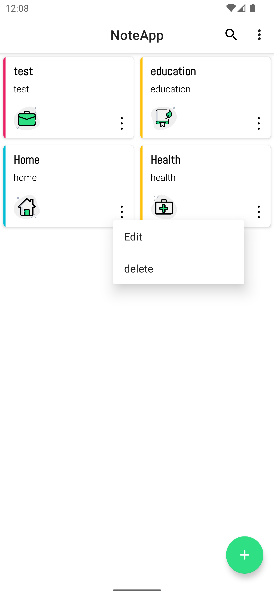
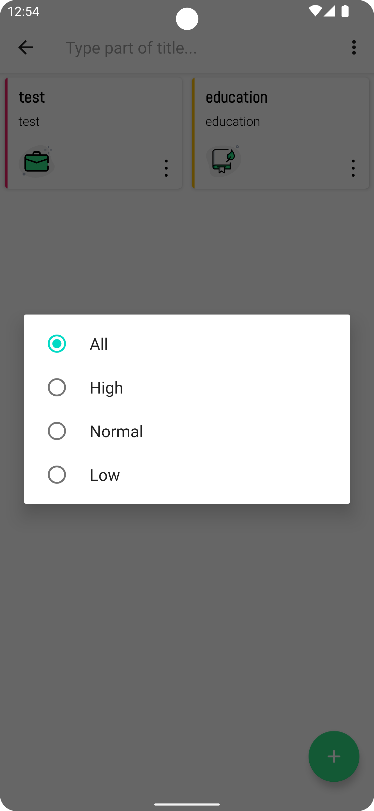
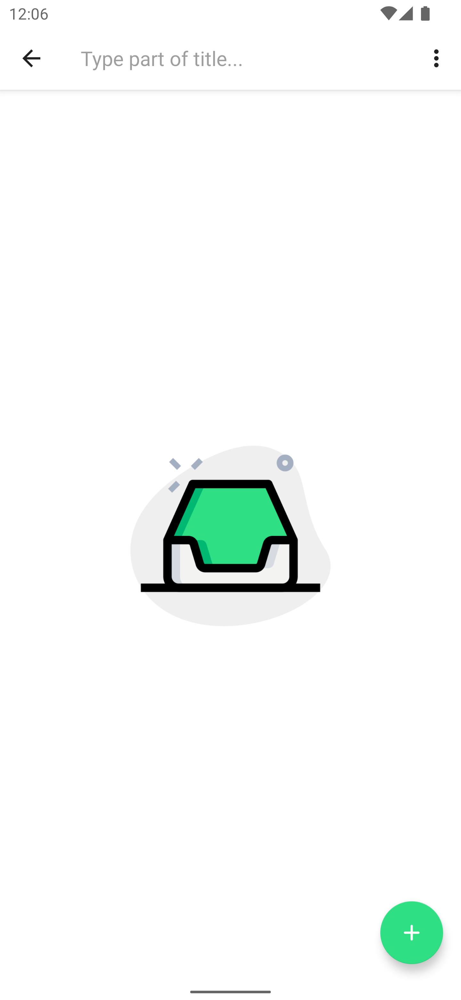
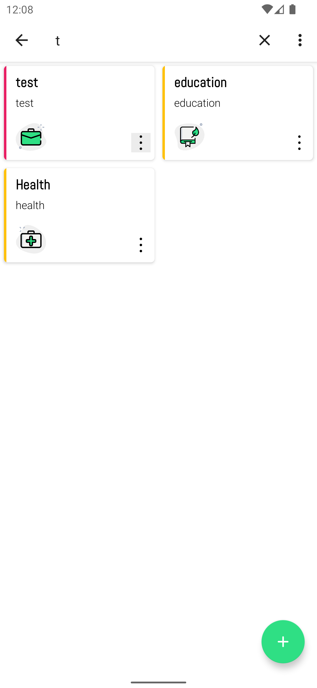
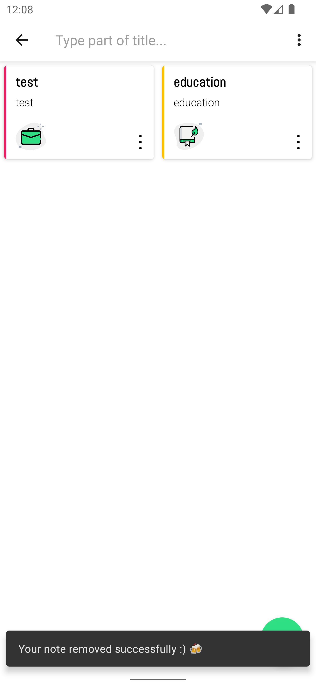

# NoteAppMVP

NoteAppMVP is a simple Android note-taking app presented as a Kotlin/MVP project. This repository currently includes the project README, screenshots, and an APK download link, but the application source code is not included in the repository snapshot.

## Download

The available APK is noted as working in light theme:

- [Download Note App](https://drive.google.com/file/d/1s70XkTz1MXU5wtxTLBE_6EIqGlGH7bz_/view?usp=drive_link)

## Screenshots

<p align="center">
  
  
  
  
</p>

<p align="center">
  
  
  
  
</p>

## App Overview

Based on the available screenshots and README notes, the app includes:

- Empty-state screen for no notes.
- Notes list screen.
- Add-note flow.
- Menu/options screen.
- Filtering flow.
- Search and search-results states.
- Delete-note flow.
- Light-theme focused UI.

## Repository Contents

```text
.
├── README.md
└── images
    ├── empty.png
    ├── items.png
    ├── add.png
    ├── menu.png
    ├── filter.png
    ├── search.png
    ├── searching.png
    └── delete.png
```

## Notes

The source code is not currently present in this repository. If the Kotlin/MVP implementation is added later, this README can be expanded with architecture details, setup instructions, dependencies, and build commands.
